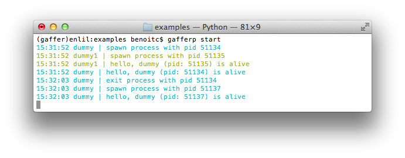
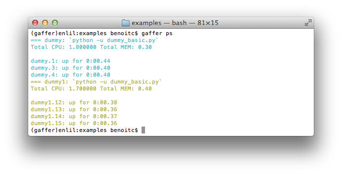

.. _gaffer:

Gaffer
======

The **gaffer** command line tool is an interface to the :doc:`gaffer
HTTP api <http>` and include support for loading/unloading Procfile
applications, scaling them up and down, ... .

It can also be used as a manager for Procfile-based applications similar to
foreman but using the :doc:`gaffer framework <processframework>`. It is
running your application directly using a Procfile or export it to a
gafferd configuration file or simply to a JSON file that you could send
to gafferd using the :doc:`HTTP api <http>`.

Example of use
--------------

For example using the following **Procfile**::

    dummy: python -u dummy_basic.py
    dummy1: python -u dummy_basic.py

You can launch all the programs in this procfile using the following
command line::

    $ gaffer start

Or load them on a gaffer node::

    $ gaffer load

and then scale them up and down::

    $ gaffer scale dummy=3 dummy1+2
    Scaling dummy processes... done, now running 3
    Scaling dummy1 processes... done, now running 3

gaffer commands
-------------------

- **start**: :doc:`pm/start`
- **run**: :doc:`pm/run`
- **export**: :doc:`pm/export`
- **load**: :doc:`pm/load`
- **unload**: :doc:`pm/unload`
- **scale**: :doc:`pm/scale`
- **ps**: :doc:`pm/ps`

.. toctree::
   :hidden:
   :glob:

   pm/*

Command line usage
------------------

::

    $ gaffer
    usage: gaffer [options] command [args]

    manage Procfiles applications.

    optional arguments:
      -h, --help            show this help message and exit
      -c CONCURRENCY, --concurrency CONCURRENCY
                            Specify the number of each process type to run. The
                            value passed in should be in the format
                            process=num,process=num
      -e ENVS [ENVS ...], --env ENVS [ENVS ...]
                            Specify one or more .env files to load
      -f FILE, --procfile FILE
                            Specify an alternate Procfile to load
      -d ROOT, --directory ROOT
                            Specify an alternate application root. This defaults
                            to the directory containing the Procfile
      --endpoint ENDPOINT   Gaffer node URL to connect
      --version             show program's version number and exit

    Commands:
    ---------

        start 	Start a process
        run   	Run one-off command
        export	Export a Procfile
        load  	Load a Procfile application to gafferd
        unload	Unload a Procfile application to gafferd
        scale 	Scaling your process
        ps    	List your process informations
        help  	Get help on a command
