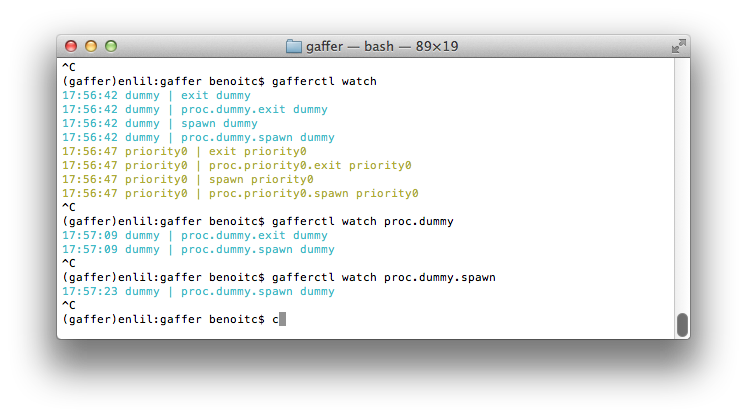

Getting started
===============

This tutorial exposes the usage of gaffer as a tool. For a general
overview or how to integrate it in your application you should read the
:doc:`overview page <overview>`.

Introduction
------------

Gaffer allows you to launch OS processes and supervise them. 3
:doc:`command line <command-line>` tools allows you to use it for now:

- :doc:`gafferd` is the process supervisor and should be launched first
  before to use other tools.
- :doc:`gaffer` is a Procfile application manager and allows you to
  load your Procfile applications in gafferd and watch their status.
- :doc:`gafferctl` is a more generic tooll than gaffer and is more admin
  oriented. It allows you to setup any process templates and manage your
  processes. You can also use it to watch the activity in gafferd
  (process activity or general activity)

A process template is the way you describe the launch of an OS process,
how many you want to launch on startup,  how many time you want to
restart it in case of failures (flapping).... A process template can be
loaded using any tool or on *gafferd* startup using its configuration
file.

Workflow
++++++++

To use gaffer tools you need to:

1. First launch gafferd
2. use either gaffer or gafferctl to manage your processes

Launch gafferd
--------------

For more informations of gafferd go on its :doc:`documentation page
<gafferd>` .

To launch gafferd run the following command line::

    $ gafferd -c /path/to/gaffer.ini

If you want to launch `custom plugins <gafferd.html#plugins>`_ with
gafferd you can also set the path to them::

    $ gafferd -c /path/to/gaffer.ini -p /path/to/plugun

.. note::

    default plugin path is relative to the user launching gaffer and is
    set to `~/.gaffer/plugins`.

.. note::

    To launch it in daemon mode use the ``--daemon`` option.

Then with the default configuration, you can check if gafferd is alive

The configuration file
++++++++++++++++++++++

The configuration file can be used to set the global configuration of
gafferd, setup some processes and webhooks.

.. note::

    Since the configuration is passed to the plugin you can also use
    this configuration file to setup your plugins.

Here is a simple example of a config to launch the dumy process from the
example folder::

    [process:dummy]
    cmd = ./dummy.py
    numprocesses = 1
    redirect_output = stdout, stderr

.. note::

    Process can be grouped. You can then start and stop all processes of
    a group and see if a process is member of a group using the HTTP
    api. (sadly this is not yet possible to do it using the command
    line).

    For example if you want dummy be part of the group test, then
    ``[process:dummy]`` will become ``[process:test:dummy]`` . A process
    template as you can see can only be part of one group.

    Groups are useful when you want to manage a configuration for one
    application or processes / users.

Each process section should be prefixed by `process:`. Possible
parameters are:

- **cmd**: the full command line to launch. eg. ``./dummy.p¨``
- **args**: arguments to pass as a string. eg. ``-some value --option=a``
- **cwd**: path to working directorty
- **uid**: user name or id used to execute the process
- **gid**: group name or id used to execute the process
- **detach**: if you wnt to completely detach the process from gafferd
  (gaffer will still continue to supervise it)
- **shell**: The process is executed in a shell (unix only)
- **flapping**: flapping rule. eg. `2, 1., 7., 5` which means
  attempts=2, window=1., retry_in=7., max_retry=5
- **redirect_input**: to allows you to interract with stdin
- **redirect_output**: to watch both stdout & stderr. output names can
  be whatever you cant. For example you. eg. ``redirect_output =
  mystdout, mystderr`` stdout will be labelled *mysdtout* in this
  case.
- **graceful_timeout**: time to wait before definitely kill a process.
  By default 30s. When killing a process, gaffer is first sending a
  ``SIGTERM`` signal then after a graceful timeout if the process hasn't
  stopped by itself send a ``SIGKILL`` signal. It allows you to handle
  the way your process will stop.
- **os_env**: true or false, to pass all operating system variables to
  the process environment.
- **priority**: Integer. Allows you to fix the order in which gafferd
  will start the processes. 0 is the highest priority. By default all
  processes have the same order.

Sometimes you also want to pass a custom environnement to your process.
This is done by creating a special configuration section named
``env:processname``. Each environmenets sections are prefixed by
``env:``. For example to pass a special PORT environment variable to
dummy::

    [env:dummy]
    port = 80

All environment variables key are passed in uppercase to the process
environment.

Manage your Procfile applications
---------------------------------

The **gaffer** command line tool is an interface to the :doc:`gaffer
HTTP api <http>` and include support for loading/unloading Procfile
applications, scaling them up and down, ... .

It can also be used as a manager for Procfile-based applications similar to
foreman but using the :doc:`gaffer framework <processframework>`. It is
running your application directly using a Procfile or export it to a
gafferd configuration file or simply to a JSON file that you could send
to gafferd using the :doc:`HTTP api <http>`.

Example of use
++++++++++++++

For example using the following **Procfile**::

    dummy: python -u dummy_basic.py
    dummy1: python -u dummy_basic.py

You can launch all the programs in this procfile using the following
command line::

    $ gaffer start

.. image:: _static/gafferp.png

Or load them on a gaffer node::

    $ gaffer load

All processes in the Procfile will be then loaded to gafferd and
started.

If you want to start a process with a specific environment file you can
create a .env in he application folder (or use the command line option to tell to
gaffer which one to use). Each environmennt variables are passed by
lines. Ex::

    PORT=80

and then scale them up and down::

    $ gaffer scale dummy=3 dummy1+2
    Scaling dummy processes... done, now running 3
    Scaling dummy1 processes... done, now running 3

.. image:: _static/gaffer_ps.png

have a look on the :doc:`gaffer` page for more informations about the
commands.

Control gafferd with gafferctl
------------------------------

*gafferctl* can be used to run any command listed below. For
example, you can get a list of all processes templates::

    $ gafferctl processes

You can simply add a process using the ``load`` command::

    $ gafferctl load_process ../test.json
    $ cat ../test.json | gafferctl load_process -
    $ gafferctl load_process - < ../test.json

test.json can be::

    {
        "name": "somename",
        "cmd": "cmd to execute":
        "args": [],
        "env": {}
        "uid": int or "",
        "gid": int or "",
        "cwd": "working dir",
        "detach: False,
        "shell": False,
        "os_env": False,
        "numprocesses": 1
    }

You can also add a process using the ``add`` command::

    gafferctl add name inc

where ``name`` is the name of the process to create and ``inc`` the
number of new OS processes to start.

To start a process run the following command::

    $ gafferctl start name

And stop it using the stop command.

To scale up a process use the ``add`` command. For example to increase
the number of processes from 3::

    $ gafferctl add name 3

To decrease the number of processes use the command ``stop``/

The command ``watch`` allows you to watch changes n a local or remote
gaffer node.

For more informations go on the :doc:`gafferctl` page.

Demo
----

.. raw:: html

    <iframe src="http://player.vimeo.com/video/51674172" width="500"
    height="163" frameborder="0" webkitAllowFullScreen
    mozallowfullscreen allowFullScreen></iframe>
